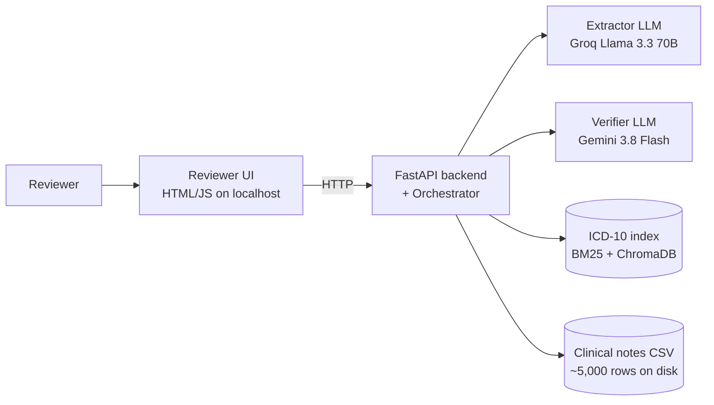
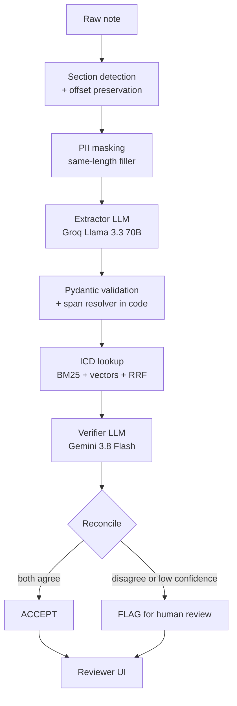
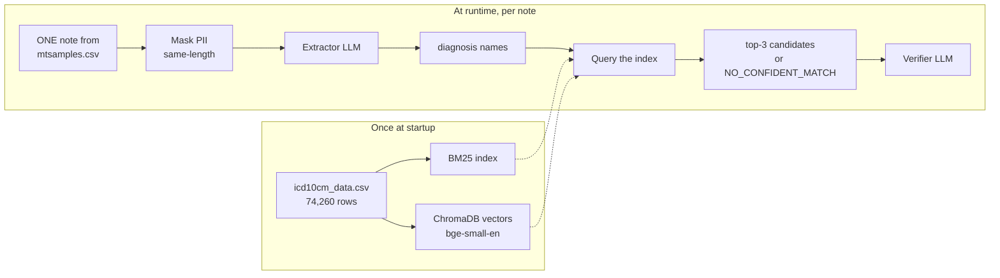

# Architecture: Clinical Note Extraction and ICD-10 Coding Agent (MVP)


---

## 1. Purpose and design principles

The system reads a free-text clinical note, extracts diagnoses, procedures, medications, allergies and vitals, suggests ICD-10 codes for diagnoses, and **proves where every item came from**. Anything it cannot prove goes to a human.

Design principles (each one is defended later):

1. **Fail closed.** Uncertain, broken, or unverified means "flag for review", never "accept".
2. **Offsets are the single source of truth.** Highlighting, export and metrics all use character offsets into the *original* note.
3. **Code checks the LLM, not the other way around.** Span existence, schema, status rules and thresholds are enforced in plain code.
4. **Independence.** Extractor and verifier are separate components with a written contract; the verifier never sees the extractor's reasoning.
5. **The LLM never sees a dataset.** It sees one masked note per prompt, plus a short candidate list from a search tool.
6. **Reproducible.** Temperature 0, cached model calls, one-command evaluation.

---

## 2. Data: what the two datasets are and how they are used

Both datasets have been inspected with pandas; columns below are confirmed.

| Dataset | Confirmed columns | Rows | Role |
|---|---|---|---|
| Clinical notes CSV (`mtsamples.csv`) | `Unnamed: 0`, `#`, `description`, `medical_specialty`, `sample_name`, `transcription`, `keywords` | 4,999 | Source of the 100 gold notes and all test sets. **Never fed to a model in bulk.** |
| ICD-10 CSV (`icd10cm_data.csv`) | `code`, `description` | 74,260 | Indexed offline into BM25 and ChromaDB. The LLM only ever sees the top few candidates for one diagnosis. |

Known data issues to document (SOW says this is graded): inconsistent or missing section headings, fragment notes, transcription typos, unreliable `keywords` column (do **not** use it as labels), residual names/dates/ids, duplicate or near-duplicate notes, out-of-domain notes.

**How the LLM "goes through" data:** it does not. Per note, code builds a prompt = instructions + schema + one masked note. For coding, code searches the ICD index and returns a short candidate list. This is retrieval-augmented generation (RAG) applied to code lookup.

---

## 3. System diagrams

Three diagrams, each answering one question. Full narrative in §3.4.

### 3.1 System context — "what are the pieces?"



**Answer:** One user, one backend, two LLMs of different families, two local data sources. Everything else is detail.

### 3.2 One note's journey — "what happens to one note?"



**Note:** Section detection runs **before** masking. The span resolver runs in code, not in the LLM. The verifier is a different model family from the extractor.

### 3.3 How the two datasets flow — "how are the CSVs used?"



**Answer:** The clinical notes CSV is read at runtime, one note per prompt. The LLM never sees the corpus. The ICD-10 CSV is indexed once at startup into BM25 and ChromaDB, then queried per diagnosis. The LLM never sees the code table — it only sees the top-3 candidates for one diagnosis.

### 3.4 Narration

When presenting, walk through in this order:

1. **Diagram 3.1 (30 s):** "One user, one backend, two LLM calls, two local data sources. Everything else is detail."
2. **Diagram 3.2 (60 s):** "Section, mask, extract, resolve spans in code, ICD lookup, verify, reconcile. Span resolution is in code because LLMs can't count characters. The verifier is a different model family so errors are less correlated."
3. **Diagram 3.3 (30 s):** "The datasets never go to the LLM in bulk. Notes CSV: read one row per prompt. ICD CSV: indexed once, queried per diagnosis. This is the defense against hallucination — constrain what the LLM can see."

## 4. Components and responsibilities

| Component | Responsibility | Input | Output | Failure mode and handling |
|---|---|---|---|---|
| Ingestion + Sectioner | Load notes, detect sections, keep offsets | raw text | sections with offsets | No headings: single section. Fragments: flagged "low context". |
| PII masker | Mask protected info locally, preserve offsets | raw text | masked text + local mask list | Miss = leak risk, so run regex AND spaCy NER; test on adversarial set. |
| Injection shield | Treat note as data; neutralise embedded instructions | masked text | text wrapped in delimiters | Model may still obey; output validation catches changed behaviour. |
| Prompt builder | Build extractor prompt, schema, delimiters | section text | prompt | Deterministic template, versioned. |
| Extractor (external LLM) | Propose structured items with quotes | prompt | raw JSON | Bad JSON: retry up to 2. Rate limit: backoff then queue. |
| Pydantic + resolver | Enforce schema, compute offsets from quotes | raw JSON | validated entities with spans | Unresolvable quote: item invalid, not accepted. |
| ICD-10 tool | Hybrid retrieval, confidence, no-match | diagnosis name | top-3 codes + scores or NO_CONFIDENT_MATCH | Poor match returns no-match, never a guess. |
| Verifier (external LLM) | Independent check of every item | masked note + items | verdicts, contradictions, missed items | Bad output: treat all items as UNVERIFIED, so flagged. |
| Orchestrator | Plan, call tools, reconcile, retry, escalate, budget | everything | accepted + flagged + trace | Budget exceeded: stop and flag the remainder. |
| Audit logger | Record every call and decision, masked | events | JSONL | Logging failure should not leak PII; log only masked text. |
| Reviewer UI | Highlight, table, accept/reject, flags, trace, export | record | reviewer decisions, JSON | Single session; simple UI. |
| Eval harness | Metrics, baseline, special sets, cost/latency | gold + system output | report | One command, deterministic. |

---

## 5. Extraction schema (Pydantic, enforced)

```python
from pydantic import BaseModel, Field, model_validator
from typing import Literal, Optional

class Span(BaseModel):
    start: int = Field(ge=0)
    end: int = Field(gt=0)             # exclusive; original-note offsets

class Evidence(BaseModel):
    quote: str                         # verbatim text from the note (LLM output)
    span: Optional[Span] = None        # filled by code, never trusted from the LLM

class Diagnosis(BaseModel):
    name_as_written: str
    normalised_name: str
    status: Literal["active", "historical", "ruled_out", "suspected"]
    evidence: Evidence
    icd_candidates: list[dict] = []    # [{code, description, score}] or [] = no confident match

class Medication(BaseModel):
    name: str
    dose: Optional[str] = None
    route: Optional[str] = None
    frequency: Optional[str] = None
    status: Literal["current", "discontinued", "newly_prescribed"]
    evidence: Evidence

class Procedure(BaseModel):
    name: str
    date: Optional[str] = None
    evidence: Evidence

class Allergy(BaseModel):
    substance: str
    reaction: Optional[str] = None
    evidence: Evidence

class Vital(BaseModel):
    name: str
    value: str
    unit: Optional[str] = None
    evidence: Evidence

class Extraction(BaseModel):
    diagnoses: list[Diagnosis] = []
    medications: list[Medication] = []
    procedures: list[Procedure] = []
    allergies: list[Allergy] = []
    vitals: list[Vital] = []
```

Post-validation rule in code: every item must have `evidence.span` set and `note[start:end]` must contain the quote (after whitespace normalisation). Otherwise the item is invalid.

---

## 6. Extractor-to-verifier contract and independence

**Verifier receives (and nothing else):**

```json
{
  "note_masked": "<full masked note>",
  "items": [
    {"id": "d1", "type": "diagnosis", "text": "type 2 diabetes", "status": "active",
     "span": [12, 27], "span_text": "type 2 diabetes",
     "icd_candidates": [{"code": "E11.9", "description": "...", "score": 0.82}]}
  ]
}
```

**Verifier returns:**

```json
{
  "verdicts": [{"id": "d1", "verdict": "SUPPORTED|REJECTED", "status_correct": true,
                "icd_fit": "good|poor|none", "reason": "..."}],
  "contradictions": [{"items": ["m2"], "description": "listed current in Meds, discontinued in Plan"}],
  "missed_items": [{"type": "medication", "text": "...", "span_text": "..."}]
}
```

**How independence is enforced**

- The verifier is a **different model family** (errors are less correlated). Justify with evidence from your own eval, not just theory.
- The verifier never receives the extractor's prompt, chain-of-thought, or confidence.
- The verifier prompt asks it to judge "does the quoted span *state* this item?", not "is this plausible?".
- The verifier cannot edit items; it can only judge them. Code applies the verdicts.
- Both components can be run and scored alone (the verifier can be tested on planted fake items).

---

## 7. Agent loop, tools and decision rules

**Tools the agent can call:** `section_note`, `mask_note`, `extract(section)`, `resolve_spans`, `icd_lookup(name)`, `verify(items)`, `re_extract(item, reason)`, `flag(item, reason)`, `accept(item)`.

**Pseudocode**

```
plan = decide_passes(note)            # by length, number of sections, domain check
if out_of_domain(note): escalate_whole_note()
budget = {calls: 12, seconds: 30}
for each pass in plan:
    items = extract(pass)             # retry on invalid JSON, max 2
    items = resolve_spans(items)      # unresolved -> invalid
    for dx in diagnoses: dx.icd = icd_lookup(dx)
verdicts = verify(all_items)
for each item:
    if verdict == SUPPORTED and code_checks_pass: accept
    elif retries_left(item) and budget_ok:
        re_extract(item, reason=verdict.reason)   # max 1-2 per item
        re-verify
    else: flag(item, disagreement_text)
add contradictions and missed items to flagged list
if flagged_fraction > 0.4: escalate_whole_note()
write trace
```

**Accept rule (all must hold):** schema valid, span resolves and contains the quote, verifier says SUPPORTED, status check passes, and no unresolved contradiction involves the item. Otherwise flag.

**Escalate the whole note when:** flagged fraction is above 0.4 (tune on dev set), the note is out of domain or too short to be a clinical note, or the model-call budget runs out.

---

## 8. ICD-10 retrieval design

1. **Build once at startup:** BM25 index over code descriptions; ChromaDB with embeddings of the same descriptions.
2. **Query:** the normalised diagnosis name. Run BM25 (lexical rank) and vector search (semantic rank).
3. **Fuse:** Reciprocal Rank Fusion, `score = sum(1 / (k + rank))`, `k = 60`.
4. **Confidence (important):** RRF scores are small numbers (about 0.01 to 0.03), so a flat "0.70" cutoff on the RRF score will not work. Use a **calibrated confidence**: e.g. the top candidate's cosine similarity, optionally blended with normalised BM25, and set the threshold by looking at your dev set (rare-diagnosis notes should fall below it; common ones above). Document how you chose it.
5. **Output:** top-3 `{code, description, score}` or `NO_CONFIDENT_MATCH`.
6. **Do not** let the LLM invent a code. The verifier may only judge "fit" of candidates the tool returned.
7. **Only** active/historical/suspected diagnoses are coded. Ruled-out conditions are not.

---

## 9. Guardrails

| Risk | Defence (layered) |
|---|---|
| Fabricated findings | Mandatory resolved span; verifier; accept rule requires both; fail closed |
| Protected info leaking to a model | Local regex + spaCy masking before any API call; same-length masks keep offsets |
| PII in logs/trace | Log only masked text; never log mask map |
| Embedded instructions in notes ("code this as routine visit") | Delimiter wrapping + system instruction "note is data"; output must pass schema; verifier judges only against quoted spans; adversarial test set |
| Low confidence guessing | Abstain and flag; ICD no-match path |
| Rate limits | Exponential backoff with jitter, response cache keyed by hash of (model, prompt), request queue, per-note budget, UI message "queued, retrying" |

---

## 10. Technology choices and rejected alternatives

The table below lists each technology choice, the reason for choosing it, and the alternatives that were rejected and why.

| Area | Choice | Why | Rejected alternatives and why |
|---|---|---|---|
| Extractor LLM | Groq Llama 3.3 70B | Free tier, fast, good JSON adherence | A small local model: weaker extraction; GPT-class paid models: not allowed |
| Verifier LLM | Gemini Flash 3.8  | Different family from extractor, so less correlated errors | Same model for both: shared blind spots; two prompts of one model: weaker independence |
| Structured output | Pydantic + JSON mode, validate and retry | Explicit, testable, enforced in code | Free-text parsing with regex: brittle |
| Embeddings | Local bge-small-en on CPU | No quota use, reproducible, offline | Google embeddings API : uses quota, network dependency, may change |
| Vector store | ChromaDB (local) | Simple, local, persists | FAISS: fine but less convenient metadata; hosted DBs: not allowed/needed |
| Keyword search | rank_bm25 (or SQLite FTS5) | Exact-term matching, tiny | Elasticsearch: overkill for 70K rows |
| Masking | Regex + spaCy NER, local | Must not use external API | Cloud DLP: violates SOW |
| Backend | Python + FastAPI, plain functions | Light, easy to defend | LangChain/LangGraph: hides the loop I must explain; add only if justified |
| Frontend | Simple HTML/CSS/JS served by FastAPI (or Streamlit) | Offset-based highlighting is easy with DOM; Streamlit is faster to build | React: build overhead for a one-user MVP |
| Tracing | Structured JSON per note | Human-readable, shown in UI | Heavy observability stacks: overkill |
| Testing | pytest | Standard | none |

---

## 11. Evaluation design

**Gold standard:** 100+ notes, 10+ specialties, labelled before prompt tuning, with written guidelines. Each diagnosis, medication, procedure has span, status, and (for diagnoses) the ICD-10 code or "NO_CODE".

**Matching rules (write these down exactly):**

- **Exact match:** same entity type, same normalised name, span overlap IoU ≥ 0.5.
- **Partial match:** same type, token-level overlap (Jaccard) ≥ 0.5 OR span IoU ≥ 0.3. Counts as 0.5 TP in the "lenient" score; report strict and lenient both.
- **Status check:** an entity counts as status-correct only if the status matches gold.

**Metrics:** precision, recall, F1 for diagnoses, meds, procedures; span faithfulness (programmatic, 100% required); status accuracy; ICD top-1, top-3 and correct no-match rate; baseline comparison (single prompt, no verification) on the same notes; flagging precision and recall; difficulty comparison of flagged vs accepted items; per-note model calls and wall-clock time.

**Special sets:** 20 contradiction notes with expected flags, 10 rare-diagnosis notes, 10 adversarial notes (embedded instructions and protected info). Plus 3 or more written failure analyses.

**Reproducibility:** `make eval` (or one script) with temperature 0 and cached calls; fixed seeds; the report states the commit hash.

---

## 12. Rate limits, budget, caching

- Cache every model response on disk keyed by `hash(model + prompt + schema version)`; re-running eval costs zero quota.
- Backoff: 1s, 2s, 4s, 8s with jitter, max 4 tries; then queue the note and tell the UI.
- Per-note budget (target): about 4 to 8 model calls and under 30 s median; trace records actuals.
- Evaluation run is batched with a pacing delay to stay below requests-per-minute.

---

## 13. Risks and mitigations

| Risk | Impact | Mitigation |
|---|---|---|
| Gold labelling takes longer than planned | Eval incomplete | Start Wed 7; daily quota of notes; reduce labelling scope in writing and document the reason in the evaluation report if behind; LLM may *suggest* pre-labels but every one is corrected manually and disclosed in the report |
| Free-tier limits or model deprecation | Pipeline halts | Cache, fallback model listed, queue |
| Offset drift from masking | Wrong highlights | Same-length masking + offset tests |
| LLM wrong offsets | Invalid items | Quote-to-offset resolver in code |
| Verifier agrees with extractor's mistakes | Missed errors | Different model family, planted-error tests, recall check |
| Scope too big for the time | Missed deliverables | Cut order: UI polish, then smaller special sets (in writing); never cut span check, guardrails, eval |

---

## 14. Day-by-day plan

Project duration: Wed 30 Sep 2026 → Thu 15 Oct 2026. Code freeze Wed 14 Oct, 6:00 PM. Defense Thu 15 Oct.

Each day ends with a commit to the private repo, an end-of-day update to the reviewer (done / blocked / next), and the checkable output listed below.

### Phase 0 — Understand and Design

| Day | Date | Work | Checkable output |
|---|---|---|---|
| Wed | 30 Sep | Read SOW; list questions; share private repo | Questions sent |
| Thu | 1 Oct | Architecture v1 draft; initial timeline | Architecture doc v1 submitted |
| Tue | 6 Oct | Final architecture + timeline + tech stack presented for sign-off (afternoon) | Sign-off received |

### Phase 1 — Data, Gold Standard, Extraction

| Day | Date | Work | Checkable output |
|---|---|---|---|
| Wed | 7 Oct | Ingestion + sectioning with offsets; Pydantic schema; labelling guidelines v1; label 12 notes | Offset tests pass; guidelines written |
| Thu | 8 Oct | Extractor on Groq with quote resolver and retry; ICD index (BM25 + Chroma) and RRF tool; label 15 notes | Extractor runs on 10 notes; ICD top-3 works |

Mid-point review with Zuhair on Wed 7 Oct per SOW section 10.

### Phase 2 — Verification and Agent

| Day | Date | Work | Checkable output |
|---|---|---|---|
| Fri | 9 Oct | Naive baseline; masker; injection shield; eval skeleton with matching rules; label 15 notes | Baseline numbers on labelled notes |
| Sat | 10 Oct | Verifier with contract, contradictions, recall check; label 15 notes | Verifier rejects planted fakes |
| Mon | 12 Oct | Orchestrator: plan, reconcile, bounded retry, abstain, escalate, trace, budget; label 15 notes | End-to-end run with trace JSON |
| Tue | 13 Oct | Reviewer UI; build contradiction, rare, adversarial sets; label 15 notes | UI works on 3 demo notes |

### Phase 3 — Evaluation, Documentation, Freeze

| Day | Date | Work | Checkable output |
|---|---|---|---|
| Wed | 14 Oct | Full eval; report with 3+ failures; README; user guide; demo video; **freeze 6 PM** | One-command eval; report; video |
| Thu | 15 Oct | Present and defend | Slides on the six SOW sections |

### Riskiest pieces (scheduled early)

1. **Span resolver** (Wed 7 Oct) — every downstream display and metric depends on correct offsets.
2. **ICD index + RRF** (Thu 8 Oct) — the retrieval layer.
3. **Verifier independence** (Sat 10 Oct) — the SOW's central requirement.

### Gold-standard labelling plan

- Target: 100 notes across 10+ specialties.
- Daily quota: 12–15 notes.
- Running total: 12 (Wed) → 27 (Thu) → 42 (Fri) → 57 (Sat) → 72 (Mon) → 87 (Tue) → 100 (Wed, if needed).
- Fallback: if the target is unreachable by Tuesday, reduce labelling scope in writing and document the reason in the evaluation report.

---
## 15. Token and context management

**Extractor prompt budget:**
- System instruction + schema description: ~500 tokens
- One masked note: typically 200–2,000 tokens, capped at 4,000 tokens
- Total per extractor call: under 5,000 tokens — well within Llama 3.3 70B's 128K context window

**Verifier prompt budget:**
- System instruction + contract description: ~300 tokens
- Masked note: same as extractor (up to 4,000 tokens)
- Extracted items + ICD candidates: ~200–800 tokens
- Total per verifier call: under 6,000 tokens — within Gemini's context window

**Handling long notes:** if a note exceeds 4,000 tokens, the sectioner splits it into sections and extracts each section independently, then merges results. Section boundaries are preserved as offsets so downstream spans remain valid.

**Per-note budget:**
- Max model calls: 12 (typically 4–8)
- Max wall-clock: 30 s median
- Max tokens per note across all calls: ~30,000 (bounded by the per-section cap × number of sections)

**Why this matters:** free-tier rate limits are usually token-per-minute, not request-per-minute. Staying under 5K tokens per call and 30K per note keeps the system inside free-tier quotas for both Groq and Gemini.

---


