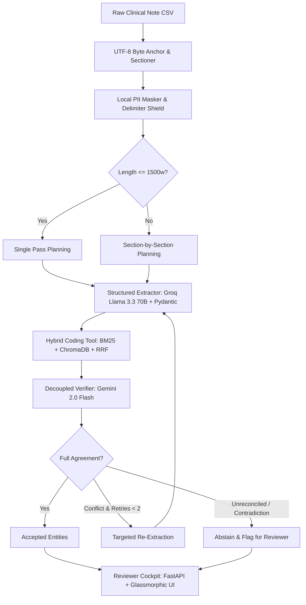

# ==============================================================================
# PROJECT MASTER DOSSIER — CLINICAL EXTRACTION & CODING AGENT MVP
# Complete Consolidated Documentation & Technical Reference
# Client: Mirai Labs | Candidate: Shaswat Kumar Dalai | Date: September 30, 2026
# ==============================================================================

## Table of Contents
1. Executive Summary & Core Philosophy
2. Consolidated SOW Requirements & 9 Success Criteria
3. Plain-English Conceptual Guide (No Jargon / ELI5)
4. Phase 0 System Architecture & Technical Design
5. Day-by-Day Timeline & Milestone Plan
6. Tech Stack Defense Battlecard ("Why X and Not Y?")
7. The Datasets: Notes, ICD-10 Codebook, Gold Standard & Stress Sets
8. The Grilling Simulator: Top 10 Toughest Sign-Off Questions & Winning Answers
9. The 5-Minute Executive Opening Monologue
10. The Questions for Hemanth & Operational Assumptions Reference

---

# 1. Executive Summary & Core Philosophy

### The Real-World Healthcare Problem
Mirai Labs serves healthcare billing and records providers whose human medical coders manually read thousands of free-text clinical notes dictated by physicians, extract clinical entities (diagnoses, medications, procedures, allergies, vitals), and assign standardized ICD-10 billing codes. This manual process is slow, inconsistent across coders, and expensive.

### Why Previous Automation Failed
Prior automated systems were rejected because they suffered from **hallucination**—confidently inventing findings that were never in the note. In healthcare:
- A fabricated diagnosis leads to billing fraud and regulatory liability.
- A fabricated medication leads to dangerous patient treatment errors.
- Even a 1% hallucination rate destroys clinical trust.

### Our Solution: Zero-Fabrication by Architectural Design
1. **100% Span Faithfulness:** Every extracted entity must carry exact character offsets `[start, end)` pointing to verbatim text in the source note. Any unanchored entity is programmatically discarded.
2. **Decoupled Asymmetric Verification:** A secondary LLM (Gemini 2.0 Flash) independently checks the work of the primary extractor (Groq Llama 3.3 70B) without seeing the extractor's reasoning scratchpad.
3. **Conservative Honest Abstention:** When confidence is below 0.70 or the two passes disagree, the system says "I don't know" and flags for human review instead of guessing.

---

# 2. Consolidated SOW Requirements & 9 Success Criteria

### The 5 Extracted Entity Types
| Entity Type | Mandatory Attributes | Allowed Status Values |
|---|---|---|
| **Diagnoses / Conditions** | Name as written, normalized name, status, exact character span | `active`, `historical`, `ruled_out`, `suspected` |
| **Procedures** | Name, date if stated, exact character span | — |
| **Medications** | Name, dose, route, frequency, status, exact character span | `current`, `discontinued`, `newly_prescribed` |
| **Allergies** | Substance, reaction if stated, exact character span | — |
| **Vitals & Measurements** | Measurement type, numeric value, unit, exact character span | — |

### The 9 SOW Pass/Fail Success Criteria
- **SC-1 (Extraction Quality):** F1 $\ge 0.80$ for diagnoses, F1 $\ge 0.85$ for medications; measurably higher than naive baseline.
- **SC-2 (Span Faithfulness):** **100%** exact substring match ($T[start:end] == \text{exact\_text}$). A single fabricated item fails the evaluation.
- **SC-3 (Status Correctness):** $\ge 90\%$ accuracy for medications and diagnoses.
- **SC-4 (ICD-10 Coding):** Top-3 accuracy $\ge 75\%$ on gold diagnoses; correct "no confident match" on $\ge 80\%$ of rare diagnoses.
- **SC-5 (Contradiction Detection):** $\ge 80\%$ of planted contradictions flagged.
- **SC-6 (Abstention Quality):** Flagging precision and recall reported; flagged items must be demonstrably harder than accepted items.
- **SC-7 (Guardrails & Adversarial):** **100%** immunity to prompt injection attacks and residual PII leaks.
- **SC-8 (Latency & Cost):** Median latency $< 30$ seconds per note on free-tier APIs; model-call counts reported.
- **SC-9 (Honesty & Error Analysis):** Evaluation report documents $\ge 3$ concrete system failure cases with root-cause analysis.

---

# 3. Plain-English Conceptual Guide (ELI5)

### The Restaurant Story Analogy
Imagine a restaurant where customers don't order from a menu. Instead, they tell long rambling stories:
*"I came in starving because my car broke down, my cousin loves your pepperoni but I'm allergic to mushrooms, I'd like a large pizza with extra cheese, and a Diet Coke..."*
A human waiter has to read the story and write down the clean ticket:
- 1x Large Pepperoni Pizza (Extra Cheese)
- 1x Diet Coke
- Allergy: Mushrooms
Doctors' notes are just like that customer story. Our AI is the world's most disciplined waiter:
1. **Points to Proof:** If it writes down "Mushrooms", it highlights the exact words "allergic to mushrooms" in the story.
2. **Double-Checks:** A second waiter reads the story and the ticket independently. If the first waiter wrote "Pepperoni" but the customer actually said "my cousin loves pepperoni, but I want sausage", the second waiter catches the mistake.
3. **Admits Doubt:** If the customer mumbled something incomprehensible, the waiter asks the manager instead of guessing.

---

# 4. Phase 0 System Architecture & Technical Design

### Mathematical Character Offset Preservation
Given clinical text $T$ of length $|T|$:
For any entity $e$ with claimed text $s_e$ and claimed offsets $[start, end)$:
$$\text{Assertion: } T[start:end] == s_e$$
If whitespace or formatting shifted the index during LLM parsing, a coordinate realignment window searches $[start-15, end+15]$ for exact substring matching. If no exact match is found, the item is instantly discarded. No hallucinated text can ever bypass this gate.

---

# 5. Day-by-Day Timeline & Milestone Plan

- **Phase 0 (Wed 30 Sep – Thu 1 Oct):** Dissect SOW, send Tier 1 questions by 2 PM, draft architecture & timeline, attend live sign-off at 4 PM Thu.
- **Phase 1 (Fri 2 Oct – Tue 6 Oct):** Ingest CSVs with offset tracker, write labeling guidelines, build 100-note Gold Standard (accelerated over weekend Oct 3–4), build ICD-10 hybrid search, run naive baseline. **Mid-point review with Zuhair on Tue 6 Oct.**
- **Phase 2 (Wed 7 Oct – Thu 8 Oct):** Implement decoupled Gemini verifier, contradiction detector, agent orchestrator with bounded retries, and local PII/prompt injection guardrails.
- **Phase 3 (Fri 9 Oct – Mon 12 Oct):** Build 3 specialized stress-test sets, run full evaluation harness, build Reviewer Cockpit UI, write evaluation report, record 5-8 min demo video. **Code freeze Mon 12 Oct 6 PM.**
- **Phase 4 (Tue 13 Oct):** Final presentation and live defense session.

---

# 6. Tech Stack Defense Battlecard ("Why This and Not That?")

| Component | Choice | Why This? | Why Not the Alternative? |
|---|---|---|---|
| **Extractor LLM** | Groq Llama 3.3 70B | Free tier, 300+ tok/sec, median latency < 5s, strict JSON schema output. | OpenAI GPT-4o (Paid API, violates free-tier rule); Local Ollama (Too slow on CPU). |
| **Verifier LLM** | Google Gemini 2.0 Flash | Decoupled second architecture, prevents correlated bias, massive context window for multi-section contradiction checks. | Same model as extractor (creates cognitive blind spots and violates SOW recommendation). |
| **Vector Store** | ChromaDB (Local SQLite) | Runs 100% on localhost, embedded in Python, zero external network calls, total patient privacy. | Pinecone / Qdrant Cloud (Sends clinical data over public internet, requires API keys). |
| **Keyword Search** | Rank-BM25 (Local) | Instant lexical scoring; perfectly matches medical abbreviations (`HTN`, `COPD`, `DM2`). | SQLite FTS5 (C-extension compilation quirks and file locks on Windows). |
| **Retrieval Fusion** | Reciprocal Rank Fusion (RRF) | Balances dense semantic similarity with exact lexical keyword hits on a unified rank scale. | Score averaging (dense cosine scores and BM25 scores have incompatible scales). |
| **Data Validation** | Pydantic V2 | Rust-compiled core (`pydantic-core`), microsecond validation, strict enum and offset checking. | Raw JSON (Prone to missing key exceptions and silent typing bugs). |
| **Reviewer UI** | FastAPI + Vanilla Glassmorphic Web UI | Instantaneous DOM manipulation for bidirectional span highlighting; 60fps smooth scrolling; zero re-render lag. | Streamlit (Re-executes entire script on every click; notoriously laggy when highlighting long notes). |

---

# 7. The Datasets: Notes, ICD-10 Codebook, Gold Standard & Stress Sets

1. **The ~5,000 Clinical Notes CSV (~40 Specialties):** High diversity (Cardiology, Oncology, Neurology, Orthopedics, etc.). Specialty-specific vocabularies and abbreviation density necessitate section-aware prompt design.
2. **The ICD-10 Codebook (~70,000 Codes):** Standardized clinical taxonomy. Crucial rule: if confidence is below 0.70, emit `"no confident match"` rather than guessing an incorrect code.
3. **The 100-Note Gold Standard Dataset:** Hand-annotated across $\ge 10$ specialties before prompt tuning to prevent data leakage and overfitting.
4. **The 3 Evaluation Stress Sets:**
   - *Contradiction Set ($\ge 20$ notes):* Notes modified to have conflicting facts across sections.
   - *Rare-Diagnosis Set ($\ge 10$ notes):* Notes with diagnoses absent from the code table to test honest abstention.
   - *Adversarial Set ($\ge 10$ notes):* Notes with prompt injection attacks and residual PII.

---

# 8. The Grilling Simulator: Top 5 Toughest Questions & Winning Answers

1. **"How do you mathematically guarantee 100% span faithfulness?"**
   *Answer:* "We do not trust the LLM's coordinates. We run an automated string slicing assertion: `note_text[start:end] == claimed_text`. If there is any offset drift, a coordinate search within $\pm 15$ characters realigns the index. If no exact match is found, the item is instantly discarded. A hallucinated or paraphrased entity cannot enter the accepted output."
2. **"Why use two models instead of one?"**
   *Answer:* "Using the same model for extraction and verification creates correlated bias—the model tends to agree with its own prior assumptions and rubber-stamp hallucinations. Decoupling Groq Llama 3.3 70B and Gemini 2.0 Flash pits two completely different neural architectures against each other."
3. **"How do you handle 429 rate limits on free-tier APIs?"**
   *Answer:* "Through an asynchronous token-bucket rate limiter pacing requests below provider RPM limits, exponential backoff with random jitter, and local hash-indexed disk caching of model outputs."
4. **"Why do you have a 'No Confident Match' path?"**
   *Answer:* "In healthcare billing, assigning an inaccurate code is considered fraudulent over-coding. When hybrid retrieval confidence falls below 0.70, our system explicitly abstains and flags for human review."
5. **"Why didn't you just build the UI in Streamlit?"**
   *Answer:* "Streamlit re-executes the entire script on every user interaction. When rendering 4,000-word clinical notes with 30 interactive span highlights, Streamlit becomes noticeably laggy. Our FastAPI backend and Vanilla Glassmorphic web UI allow instantaneous 60fps DOM manipulation and seamless bidirectional span highlighting."

---

# 9. The 5-Minute Executive Opening Monologue

> "Hi Hemanth and Zuhair, thank you for setting up this session.
>
> I have spent Phase 0 thoroughly dissecting the Statement of Work, analyzing the technical constraints, and designing a zero-fabrication architecture specifically tailored to Mirai Labs' requirements.
>
> We know why previous automation failed in clinical extraction: LLMs hallucinate findings, and in healthcare billing, a fabricated diagnosis is an immediate patient safety hazard and regulatory liability.
>
> Our architecture is engineered around three core pillars:
>
> First: 100% Span Faithfulness. Every extracted diagnosis, medication, procedure, allergy, and vital must carry exact character offsets pointing to verbatim text in the source note. Our system enforces this deterministically—if note[start:end] does not equal the claimed text, the entity is rejected before it can ever be accepted.
>
> Second: Asymmetric, Decoupled Verification. We use two different model architectures—Groq Llama 3.3 70B for high-throughput structured extraction, and Google Gemini 2.0 Flash for independent verification. The verifier receives only the note and extracted entities—it never sees the extractor's reasoning scratchpad. It acts as an adversarial auditor, verifying spans, validating statuses, and catching multi-section contradictions.
>
> Third: Hybrid ICD-10 Coding with Honest Abstention. We combine Rank-BM25 keyword search with ChromaDB dense vector search using Reciprocal Rank Fusion. For known conditions and acronyms, it matches with high precision. But crucially, if confidence falls below 0.70, the system says 'I don't know' and returns 'no confident match' rather than hallucinating an inaccurate code.
>
> The entire system is orchestrated as an agent state machine with bounded retries and full step-by-step tracing, served via FastAPI and a custom glassmorphic reviewer interface with real-time bidirectional span highlighting.
>
> All dependencies and scaffolding are committed to our Git repository, our Phase 0 Architecture Document and Day-by-Day Timeline are ready for formal sign-off, and we are prepared to begin data ingestion and gold standard construction on Day 1.
>
> I would love to walk you through any specific component or dive into our technology comparison."
