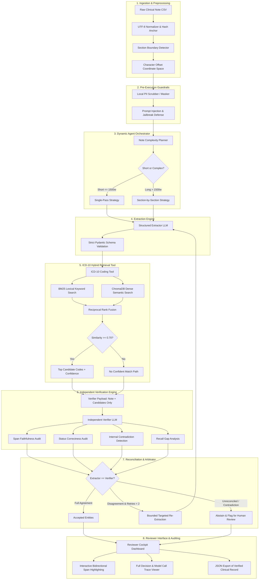

# System Architecture & Technical Design Document
## Clinical Note Extraction & Coding Agent MVP
**Document Version:** 1.0.0  
**Phase:** Phase 0 (Design & Architecture Sign-off)  
**Date:** Wednesday, September 30, 2026  
**Candidate / Author:** Shaswat Kumar Dalai  
**Client / Reviewers:** Hemanth & Zuhair (Mirai Labs)  
**Status:** Ready for Sign-Off Review (Thursday, October 1, 2026)  

---

## 1. Executive Summary & Architectural Philosophy

Clinical documentation pipelines demand an unprecedented standard of verifiability: in clinical decision support and medical coding, **hallucination is not a benign nuisance—it is a patient safety violation and a regulatory liability**.

This system is engineered under the principle of **Zero-Fabrication by Architectural Design**:
1. **Span-Anchored Ground Truth:** No clinical entity (diagnosis, medication, procedure, allergy, vital) can enter the accepted state without an exact, verified substring span with precise character offsets $[start, end)$ referencing the immutable source note.
2. **Adversarial Asymmetric Verification:** The extraction and verification passes are completely decoupled. The verifier receives only the original note and extracted candidate entities. It never receives the extractor's chain of thought or intermediate rationales, preventing cognitive bias ("rubber-stamping").
3. **Conservative Bounded Orchestration:** The agent is an intelligent state machine governed by deterministic budgets. Disagreements between extractor and verifier trigger structured reconciliation with bounded retries ($N \le 2$). Unreconciled conflicts immediately abstain and escalate to the human reviewer with explicit conflict summaries.
4. **Resilient Local & Free-Tier Decoupling:** Free-tier rate limits (Groq / Gemini) are treated as first-class architectural constraints, managed via leaky-bucket pacing, exponential backoff, and local caching.

---

## 2. End-to-End System Architecture



---

## 3. Component Deep Dive & Responsibilities

### 3.1 Note Ingestion & Sectioning Engine (`src/ingestion`)
* **Responsibilities:**
  - Ingest notes from CSV (~5,000 notes, ~40 specialties).
  - Normalize text encodings to standard NFC Unicode while preserving exact byte/character offsets.
  - Detect standardized clinical section boundaries:
    - Chief Complaint (CC)
    - History of Present Illness (HPI)
    - Past Medical History (PMH)
    - Medications
    - Allergies
    - Physical Examination
    - Assessment & Plan (A&P)
  - Retain character offset ranges $[sec_{start}, sec_{end})$ for every detected section.

### 3.2 The Span Preservation Mathematical Contract
* **The Problem:** LLMs often paraphrase or slightly alter whitespace, resulting in drift between the extracted snippet and the original note text. A single off-by-one error fails the SOW 100% span faithfulness criterion (SC-2).
* **The Mathematical Guarantee:**
  Given original note text $T \in \Sigma^*$ of length $|T|$:
  For any extracted entity $e$, the extractor returns candidate substring $s_e$.
  The system computes the exact matching coordinates:
  $$[start, end) \subset [0, |T|) \quad \text{such that} \quad T[start:end] == s_e$$
  If whitespace normalization occurs, an exact reverse index mapping function $M: \text{NormPos} \to \text{OrigPos}$ translates positions back to the verbatim original text.
  **Hard Rule:** If $T[start:end] \neq s_e$, the extraction is instantly flagged as **Invalid Span Offset** and rejected prior to downstream consumption.

### 3.3 Structured Extraction Engine (`src/extractor`)
* **Responsibilities:**
  - Leverage LLM structured output enforced by strict Pydantic schemas.
  - Extracts 5 core clinical categories:
    1. **Diagnoses / Conditions:** Name as written, normalized name, status (`active`, `historical`, `ruled_out`, `suspected`), exact span.
    2. **Procedures:** Procedure name, date if stated, exact span.
    3. **Medications:** Name, dosage, route (oral, IV, topical), frequency (QD, BID, PRN), status (`current`, `discontinued`, `newly_prescribed`), exact span.
    4. **Allergies:** Allergen substance, documented reaction (rash, anaphylaxis), exact span.
    5. **Vitals & Measurements:** Measurement name (BP, HR, RR, Temp, SpO2, Weight, Height), numeric value, unit, exact span.

### 3.4 ICD-10 Coding Tool (`src/coding`)
* **Architecture:** Hybrid Retrieval with Reciprocal Rank Fusion (RRF).
  - **Lexical BM25:** Matches exact clinical nomenclature, medical abbreviations ("HTN", "DM2", "COPD"), and exact synonyms.
  - **Dense Vector Search (ChromaDB):** Handles descriptive clinical language ("elevated blood pressure without diagnosis of hypertension" $\to$ I10).
  - **Hybrid Scoring Formula:**
    $$RRF\_Score(d) = \sum_{m \in \{BM25, Dense\}} \frac{w_m}{k + rank_m(d)}$$
  - **Confidence Thresholding:**
    - If top candidate normalized score $\ge 0.70$: Return Top-3 candidates with code, official tabular description, and confidence score.
    - If top candidate normalized score $< 0.70$: Return explicit `"no confident match"` sentinel. The system will NEVER guess.

### 3.5 Independent Verification Engine (`src/verifier`)
* **Asymmetry Rule:** The verifier receives:
  1. The raw, masked clinical note text.
  2. The list of extracted candidate entities with their claimed character spans.
  *It does NOT receive the extractor's system prompt, reasoning trace, or scratchpad.*
* **Verification Checks:**
  1. **Span Faithfulness:** Does $T[start:end]$ strictly support the claim? Does the context confirm the clinical entity, or is it a negated/hypothetical mention?
  2. **Status Audit:** Is a past condition falsely labelled active? Was a discontinued drug marked as current?
  3. **Contradiction Detection:** Does Section A state "Patient is tolerating Lisinopril" while Section B states "Lisinopril stopped due to angioedema"?
  4. **Missed Entity Discovery (Recall Check):** Scans for critical clinical entities present in the note that the extractor overlooked.

### 3.6 Agent Orchestration & Arbitration (`src/orchestrator`)
* State Machine Flow:
  - **Step 1: Plan:** Evaluate note length, token count, and complexity. Select single-pass vs. section-by-section.
  - **Step 2: Extract:** Invoke structured extractor tool.
  - **Step 3: Code:** Invoke ICD-10 coding tool for all extracted diagnoses.
  - **Step 4: Verify:** Invoke independent verification tool.
  - **Step 5: Reconcile:** Compare extractor output against verifier findings:
    - *Mutual Agreement:* Promote to `ACCEPTED`.
    - *Discrepancy (Status or Span):* If budget allows (retry $< 2$), issue targeted prompt: *"Verifier noted conflict: [X]. Please re-evaluate span [Y]."*
    - *Unresolvable Conflict or Contradiction:* Mark as `FLAGGED_FOR_HUMAN_REVIEW` with documented rationale.
  - **Step 6: Escalate:** If conflict rate $> 40\%$ of all items, escalate entire note for Senior Coder review.

### 3.7 Guardrails & Safety Layer (`src/guardrails`)
* **PII Masking:** Local rule-based regex patterns + local NER to redact names, MRNs, phone numbers, and SSNs prior to any cloud API transmission.
* **Prompt Injection Sanitization:** Note content is wrapped in strict structural XML delimiters (`<clinical_note_untrusted_content>`) with system instructions stating that any instructions inside the note tags are untrusted clinical narrative data and must never be interpreted as commands.
* **Audit Logging:** Every raw request, raw response, latency figure, and token usage count is serialized to an append-only JSONL audit log.

### 3.8 Reviewer Interface (`src/ui`)
* **Tech Stack:** FastAPI backend + Modern Vanilla CSS Glassmorphic Web UI.
* **Key Features:**
  - **Bidirectional Interactive Highlighting:** Clicking any entity in the structured table automatically scrolls to and highlights the source span in the note; clicking highlighted text in the note opens the corresponding entity card.
  - **Category Color Coding:**
    - Diagnoses: Violet / Purple
    - Medications: Emerald / Green
    - Procedures: Amber / Orange
    - Allergies: Rose / Red
    - Vitals: Cyan / Blue
  - **Flagged Panel:** High-contrast alert cards for unresolved discrepancies and contradictions with explicit explanations.
  - **Full Agent Trace View:** Collapsible step-by-step audit showing model calls, tool responses, latency, and arbitration logic.
  - **One-Click JSON Export:** Downloads the validated clinical documentation payload.

---

## 4. Technical Stack Justification

| Layer | Chosen Technology | Alternatives Considered | Justification & Trade-offs |
|---|---|---|---|
| **LLM Extractor** | Groq Llama 3.3 70B (Fast, Free-tier) | Local Ollama, OpenAI | Extremely high throughput (~300 tok/sec), zero cost, strong structured output support via JSON Schema mode. |
| **LLM Verifier** | Google Gemini 2.0 Flash (Free-tier) | Same model as extractor | Fulfills SOW recommendation for **two different models**. Prevents correlated reasoning blind spots. |
| **Structured Output** | Pydantic V2 | Raw JSON, Regex parsing | Native Python type validation, strict type coercion, sub-millisecond execution, comprehensive error reporting. |
| **Vector Database** | ChromaDB (Local in-memory / persistent) | Pinecone, Qdrant | Runs completely on localhost, no cloud setup or API keys required, lightweight, embedded SQLite backend. |
| **Keyword Search** | Rank-BM25 (Local) | SQLite FTS5 | Pure Python, instantaneous scoring, zero database locking issues on Windows. |
| **Embeddings** | Sentence-Transformers (Local / `bge-small-en`) or Google text-embedding-004 | OpenAI Embeddings | Free, runs locally on CPU without rate limits, fast indexing of ICD-10 codebook. |
| **Backend Server** | FastAPI + Uvicorn | Flask, Django | High performance, native Pydantic integration, asynchronous request handling, auto-generated OpenAPI documentation. |
| **Frontend UI** | Modern Vanilla HTML5 / Glassmorphic CSS / JavaScript | Streamlit | Streamlit re-runs the entire Python script on every click, creating lag with large text highlights. Custom Vanilla Web UI provides instantaneous DOM manipulation for bidirectional span highlighting, silky 60fps glassmorphic visuals, and zero latency. |

---

## 5. Rate-Limit Resilience & Token Management Strategy

Because the project relies on **free-tier APIs** (Groq and Google Gemini), rate limits (Requests Per Minute / RPM, Tokens Per Minute / TPM) are a core engineering consideration:
1. **Token Bucket Rate Limiter:** An in-memory asynchronous token bucket throttles outbound API calls to stay strictly within free-tier quotas (e.g. 30 RPM for Groq, 15 RPM for Gemini).
2. **Exponential Jittered Backoff:** On HTTP 429 (Rate Limit Exceeded), the client backs off with jitter:
   $$t_{wait} = 2^{attempt} + \text{random}(0, 1)$$
3. **Local Response Caching:** Hash-indexed caching of raw model responses during development and regression runs prevents duplicate calls for unchanged notes.
4. **Per-Note Computational Budget:** Maximum 4 LLM calls and 30 seconds wall-clock time per note. If the budget is exhausted, the note gracefully yields and flags remaining items for human review.

---

## 6. Pydantic Data Contracts (Core Schemas)

```python
from enum import Enum
from typing import List, Optional
from pydantic import BaseModel, Field

class EntityStatus(str, Enum):
    ACTIVE = "active"
    HISTORICAL = "historical"
    RULED_OUT = "ruled_out"
    SUSPECTED = "suspected"

class MedicationStatus(str, Enum):
    CURRENT = "current"
    DISCONTINUED = "discontinued"
    NEWLY_PRESCRIBED = "newly_prescribed"

class TextSpan(BaseModel):
    start_offset: int = Field(..., description="0-indexed start character offset in original note")
    end_offset: int = Field(..., description="0-indexed end character offset in original note")
    exact_text: str = Field(..., description="Exact verbatim substring from note text")

class Diagnosis(BaseModel):
    name_as_written: str
    normalized_name: str
    status: EntityStatus
    span: TextSpan
    icd10_candidates: Optional[List[dict]] = None

class Medication(BaseModel):
    name: str
    dose: Optional[str] = None
    route: Optional[str] = None
    frequency: Optional[str] = None
    status: MedicationStatus
    span: TextSpan

class Procedure(BaseModel):
    name: str
    date_stated: Optional[str] = None
    span: TextSpan

class Allergy(BaseModel):
    substance: str
    reaction: Optional[str] = None
    span: TextSpan

class VitalMeasurement(BaseModel):
    measurement_type: str
    value: str
    unit: Optional[str] = None
    span: TextSpan

class ClinicalExtractionResult(BaseModel):
    note_id: str
    diagnoses: List[Diagnosis]
    medications: List[Medication]
    procedures: List[Procedure]
    allergies: List[Allergy]
    vitals: List[VitalMeasurement]
```

---

## 7. Compliance Matrix against SOW Success Criteria

| SOW Criterion | Requirement | Architectural Enforcement Mechanism |
|---|---|---|
| **SC-1: Extraction Quality** | Diagnoses F1 $\ge 0.80$, Meds F1 $\ge 0.85$ | Few-shot clinical prompting + Section-aware chunking + Pydantic validation. |
| **SC-2: Span Faithfulness** | **100% (Zero tolerance)** | Deterministic string-slicing verification: $T[start:end] == exact\_text$. Any discrepancy triggers immediate drop/flag. |
| **SC-3: Status Correctness** | $\ge 90\%$ for meds & diagnoses | Verifier cross-references temporal and negation markers ("stopped", "denies", "history of"). |
| **SC-4: ICD-10 Coding** | Top-3 accuracy $\ge 75\%$, correct abstention $\ge 80\%$ | Hybrid BM25 + ChromaDB semantic search with confidence thresholding at 0.70. |
| **SC-5: Contradiction Detection** | $\ge 80\%$ flagged | Multi-section contradiction prompt comparing medication and diagnosis states across sections. |
| **SC-6: Abstention Quality** | Reported precision/recall | Systematic conflict scoring between Extractor and Verifier with clear human escalation queue. |
| **SC-7: Guardrails** | **100%** adversarial immunity | XML isolation delimiters + Local regex/NER PII anonymization before model dispatch. |
| **SC-8: Latency & Cost** | Median latency $< 30s$ per note | Fast Groq Llama 3.3 70B extractor + parallel verification calls + bounded retries. |
| **SC-9: Honesty & Error Analysis** | $\ge 3$ concrete failure cases | Automatic logging of edge-case failure clusters (e.g., ambiguous abbreviations, implicit dates). |

---

## 8. Sign-Off Approval Block

| Role | Name | Signature / Status | Date |
|---|---|---|---|
| **Candidate / Lead Developer** | Shaswat Kumar Dalai | Submitted | September 30, 2026 |
| **Technical Lead (Mirai Labs)** | Hemanth | *Pending Sign-Off* | October 1, 2026 |
| **Client Sponsor (Mirai Labs)** | Zuhair | *Pending Sign-Off* | October 1, 2026 |
